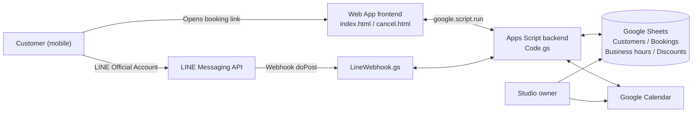

# Beauty Salon Booking & Customer Management System
**Google Apps Script × LINE Messaging API**

[中文](README.md) | [日本語](README.ja.md) | English

An online booking system built from scratch for a friend's eyelash and eyebrow (microblading) studio. The goal is to **replace repetitive, manual customer-service work with automation**. Customers open the booking page from the studio's LINE Official Account, where they can check availability, view prices, submit a booking, and look up or reschedule their appointments on their own. On the studio side, bookings sync automatically to Google Calendar, and customer profiles and booking records are created automatically.

> Note: The system was built for a studio in Taiwan, so the user interface is in Traditional Chinese.


---

## Table of Contents
- [The Problem](#the-problem)
- [Architecture](#architecture)
- [Features](#features)
- [Screenshots](#screenshots)
- [Technical Highlights](#technical-highlights)
- [My Role and Development Approach](#my-role-and-development-approach)
- [Project Structure](#project-structure)
- [Deployment](#deployment)
- [Limitations and Roadmap](#limitations-and-roadmap)

---

## The Problem

A one-person studio spends a large part of every day on back-and-forth messages. This work is highly repetitive and can be handled by a system:

| Before (manual) | After (automated) |
|---|---|
| Replying to "When are you free?" one message at a time | The booking page shows available dates and time slots for the month in real time |
| Reminding new customers to pay a deposit | The system identifies new vs. returning customers and shows deposit and bank-transfer details to new customers after they book |
| Adding bookings to the calendar by hand | Confirmed bookings are written to Google Calendar automatically |
| Keeping track of customer names, birthdays, phone numbers, and visit history | Customer profiles and booking records are created and updated automatically |
| Checking discount eligibility by hand | The system applies eligible discounts based on rules and calculates the total automatically |

**Why Google Apps Script:** It is free and requires no server of its own. For a small studio with fewer than about 100 bookings a month, it provides everything needed at almost zero operating cost.

---

## Architecture



| Component | Role |
|---|---|
| **Google Apps Script** | Backend logic and Web App hosting (serverless) |
| **HTML / CSS / JavaScript** | Mobile-first booking page and "Look up / Cancel / Reschedule" page |
| **Google Sheets** | Lightweight database: business hours, booking records, customer profiles, discount usage, LINE account links |
| **Google Calendar** | Visual schedule for the studio; available slots are calculated in real time from existing calendar events |
| **LINE Messaging API** | Official Account webhook: phone-number linking, quick access to booking, booking lookup |

---

## Features

### For customers
- **Booking policy agreement**: customers must accept the studio's policies before continuing
- **Service selection**: split into eyebrow and eyelash categories; pre-treatment notes are shown after selection, and customers can go back and choose again
- **Automatic new/returning customer detection**:
  - New customers enter their name, phone number, birthday, and how they heard about the studio (for referrals, they can enter the referrer so the studio can issue referral rewards)
  - Returning customers only enter their phone number; name and birthday are filled in automatically
- **Live availability calendar**: green = available, grey = closed, red = fully booked; selecting a date shows the available time slots
- **Price calculation and discounts**: every service and add-on shows its price, and eligible discounts are applied automatically
- **Review before submitting**: customers can go back and make changes
- **Different confirmation screens by customer type**: new customers see deposit and bank-transfer details; returning customers see their visit count
- **Look up / cancel / reschedule**: enter a phone number to see bookings and available coupons, and reschedule without contacting the studio

### For the studio
- Bookings are added to **Google Calendar** automatically
- A **business hours** sheet controls which slots can be booked
- A **booking records** sheet: new vs. returning, rescheduled or not, services, deposit status, and more
- A **customer profiles** sheet: name, birthday, phone number, first visit, visit count, most recent service, coupon status
- Manual changes made in the spreadsheet or calendar are **synced back in both directions**

### LINE Official Account
- Customers send their phone number in the chat to **link their LINE account to their booking data**, so the studio can confirm the LINE user and the person who booked are the same
- Keyword auto-replies: booking link, booking lookup, availability questions

---

## Screenshots

### 1. Booking flow (customer side)

<table>
<tr>
<th>Booking policy</th><th>Choose a category</th><th>Pre-treatment notes</th>
</tr>
<tr>
<td></td>
<td></td>
<td></td>
</tr>
<tr>
<th>New customer: referral source</th><th>Services and prices</th><th>Returning customer: auto-fill by phone</th>
</tr>
<tr>
<td></td>
<td></td>
<td></td>
</tr>
<tr>
<th>Discounts</th><th>Live availability calendar</th><th>Review before submitting</th>
</tr>
<tr>
<td></td>
<td></td>
<td></td>
</tr>
</table>

### 2. Booking confirmed

<table>
<tr><th>New customer: deposit details</th><th>Returning customer: visit count</th></tr>
<tr>
<td></td>
<td></td>
</tr>
</table>

### 3. Look up / cancel / reschedule

<table>
<tr><th>Look up by phone number</th><th>Bookings and coupons</th><th>Reschedule</th></tr>
<tr>
<td></td>
<td></td>
<td></td>
</tr>
</table>

### 4. Studio back office

| Google Calendar | Business hours |
|---|---|
|  |  |

| Booking records | Customer profiles |
|---|---|
|  |  |

**Apps Script project**


> All customer data shown in the screenshots is test data.

---

## Technical Highlights

- **Preventing double bookings (concurrency control)**: a lock is acquired with `LockService` when a booking is submitted, so two customers booking the same slot at the same moment cannot both succeed.
- **Real-time slot calculation**: combines the business hours sheet with existing Google Calendar events and checks each slot for conflicts based on service duration. Past slots, the next day (not open for online booking), and dates outside the booking window are excluded.
- **Two-way sync between Sheets and Calendar**:
  - An installable `onEdit` trigger handles status changes the studio makes in the spreadsheet
  - **Incremental sync** with `syncToken` from the Calendar advanced service: when the studio drags a booking to a new time in the calendar, only the changed events are fetched and written back to the spreadsheet
- **Config-driven pricing logic**: services, add-ons, and discounts are defined in a single `CONFIG` object. Supports formula-based prices (e.g. a discount calculated from another service's price) and discounts limited to specific services.
- **LINE webhook integration**: `doPost` receives LINE events and routes them to handlers. It deliberately returns `HtmlService` output to avoid the Apps Script Web App's 302 redirect, so LINE's webhook verification correctly receives a 200 response.
- **Multi-page routing in a single Web App**: `doGet` returns the booking page or the lookup page based on the `?page=` parameter.

---

## My Role and Development Approach

I was **responsible for requirements, workflow design, testing, and launching the system into production**. The code was written and debugged in collaboration with AI. My work included:

- Starting from the day-to-day problems of my friend's studio, identifying the workflows and business rules to automate (deposits, rescheduling, discount eligibility, new vs. returning customers, and more)
- Designing the booking flow, screen order, and spreadsheet data fields
- Giving AI requirements step by step, reading and integrating the generated code, and repeatedly testing and fixing issues in real use
- Connecting and configuring Google Calendar, Google Sheets, the LINE Official Account, and the Messaging API

This project took me through the full cycle of **requirements analysis → system design → development → testing → production use**, and it is what led me to pursue a career as a systems engineer.

---

## Project Structure

```
beauty-salon-booking-system/
├── README.md             # Chinese
├── README.ja.md          # Japanese
├── README.en.md          # English
├── images/               # Screenshots
└── src/
    ├── Code.gs           # Main backend: config, slot calculation, bookings, customer data, discounts, sync triggers
    ├── index.html        # Booking page
    ├── cancel.html       # Look up / cancel / reschedule page
    └── LineWebhook.gs    # LINE webhook: phone linking, keyword replies, push messages
```

---

## Deployment

1. Create a Google Sheets spreadsheet and copy the ID from its URL.
2. In the spreadsheet, open **Extensions → Apps Script**, create files matching `src/`, and paste in the code.
3. Edit `CONFIG` at the top of `Code.gs`:
   - `SPREADSHEET_ID`, `CALENDAR_ID`
   - `BANK_INFO` (bank-transfer details)
   - `LINE_CHANNEL_ACCESS_TOKEN`, `LINE_CHANNEL_SECRET`, `LINE_ADD_FRIEND_URL`
   - Services, prices, and discounts
4. Under **Services** in Apps Script, enable the **Google Calendar API** (advanced service, used for two-way sync).
5. Run `setupAllSyncTriggers()` once to create the triggers and grant permissions.
6. Go to **Deploy → New deployment → Web app** and copy the Web App URL.
7. In LINE Developers, set the webhook URL to that address, and add the booking link to the Official Account's rich menu.

---

## Limitations and Roadmap

**Current limitations**
- Services, prices, and discounts are defined in the code, so the studio cannot change them directly; I need to update the code. The system suits small studios with stable menus and fewer than about 100 bookings a month.
- Using Google Sheets as a database limits performance with large data volumes or many simultaneous users.

**Roadmap**
- [ ] Build the customer feedback page (`feedback.html`): the booking records already include "feedback link" and "feedback status" fields, and a unique feedback link is generated for every booking
- [ ] Move services and prices into the spreadsheet so the studio can update them without changing code
- [ ] Use time-driven triggers to send automatic LINE reminders three days before each visit (with the studio's address) and birthday offers (`pushToLine` is already implemented)
- [ ] Evaluate moving to a dedicated database (e.g. relational Cloud SQL or NoSQL Firestore) to support larger businesses
