# 美業線上預約與顧客管理系統
**Beauty Salon Booking System｜Google Apps Script × LINE Messaging API**
中文 | [日本語](README.ja.md)

為友人經營的美睫／霧眉工作室，從零打造的線上預約系統。目標是**用系統取代重複性的人工客服工作**：客人在 LINE 官方帳號點開預約頁，就能自己查空檔、看價格、送出預約、查詢與改期；店家這端則自動同步 Google 日曆、自動建立顧客資料與預約紀錄。


---

## 目錄
- [要解決的問題](#要解決的問題)
- [系統架構](#系統架構)
- [功能總覽](#功能總覽)
- [畫面展示](#畫面展示)
- [技術重點](#技術重點)
- [我的角色與開發方式](#我的角色與開發方式)
- [專案結構](#專案結構)
- [部署方式](#部署方式)
- [限制與未來改進](#限制與未來改進)

---

## 要解決的問題

一人工作室每天花大量時間在「一來一回」的訊息上，而這些工作高度重複、可以被系統取代：

| 原本的人工作業 | 系統化之後 |
|---|---|
| 手動回覆客人「哪天還有空？」 | 預約頁即時顯示當月可預約日期與時段 |
| 手動提醒新客先付訂金 | 系統自動判斷新／舊客，新客送出後自動顯示訂金與匯款資訊 |
| 手動把預約加進行事曆 | 預約成功自動寫入 Google Calendar |
| 手動整理客人姓名、生日、電話、歷史紀錄 | 自動建立／更新顧客資料表與預約紀錄 |
| 手動核對優惠資格 | 系統依規則判斷可用優惠並自動試算金額 |

**技術選型理由：** Google Apps Script 完全免費、不需要自架伺服器，對「月訂單量 100 筆以內」的小型工作室來說，功能足夠且維運成本幾乎為零。

---

## 系統架構

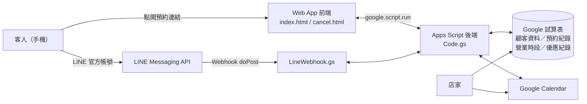

| 元件 | 角色 |
|---|---|
| **Google Apps Script** | 後端邏輯 + Web App 託管（Serverless） |
| **HTML / CSS / JavaScript** | 手機優先的預約前端與「查詢／取消／修改」頁面 |
| **Google 試算表** | 當作輕量資料庫：營業時段設定、預約紀錄、顧客資料、優惠使用紀錄、LINE 綁定 |
| **Google Calendar** | 店家可視化排程；可預約時段依日曆既有事件即時計算 |
| **LINE Messaging API** | 官方帳號 Webhook：電話綁定、快速預約入口、查詢預約 |

---

## 功能總覽

### 客人端
- **預約須知確認**：需勾選同意工作室規範才能進入下一步
- **項目選擇**：分為眉毛／睫毛兩大類，選擇後顯示對應的術前注意事項，可返回重選
- **新舊客自動識別**：
  - 新客填寫姓名、電話、生日與得知管道（朋友介紹可填寫介紹人，方便店家發放推薦優惠）
  - 舊客只需輸入電話，系統自動帶入姓名與生日
- **即時空檔月曆**：綠字可預約、灰底不開放、紅字已額滿，點選日期顯示可選時段
- **金額試算與優惠折抵**：所有方案、加購項目皆顯示價格，符合資格的優惠自動折抵
- **送出前總表確認**：可返回修改
- **預約結果依客群區分**：新客顯示訂金與匯款資訊；舊客顯示第幾次來店
- **查詢／取消／修改預約**：輸入電話即可查看預約與可用優惠券，並自助改期

### 店家端
- 預約自動寫入 **Google Calendar**
- **營業時段設定**表控制系統可預約時段
- **預約紀錄**表：新舊客、是否改期、服務項目、訂金狀態等
- **客人資料**表：姓名、生日、電話、首次來店、到店次數、最近服務、優惠券狀態
- 在試算表或日曆上手動調整，會**雙向同步**回系統

### LINE 官方帳號
- 客人在對話框輸入電話即可**綁定 LINE 帳號與預約資料**，讓店家確認 LINE 用戶與填表者為同一人
- 關鍵字快速回覆：預約入口、查詢預約、詢問時段

---

## 畫面展示

### 1. 預約流程（客人端）

<table>
<tr>
<th>預約須知</th><th>選擇項目分類</th><th>術前注意事項</th>
</tr>
<tr>
<td></td>
<td>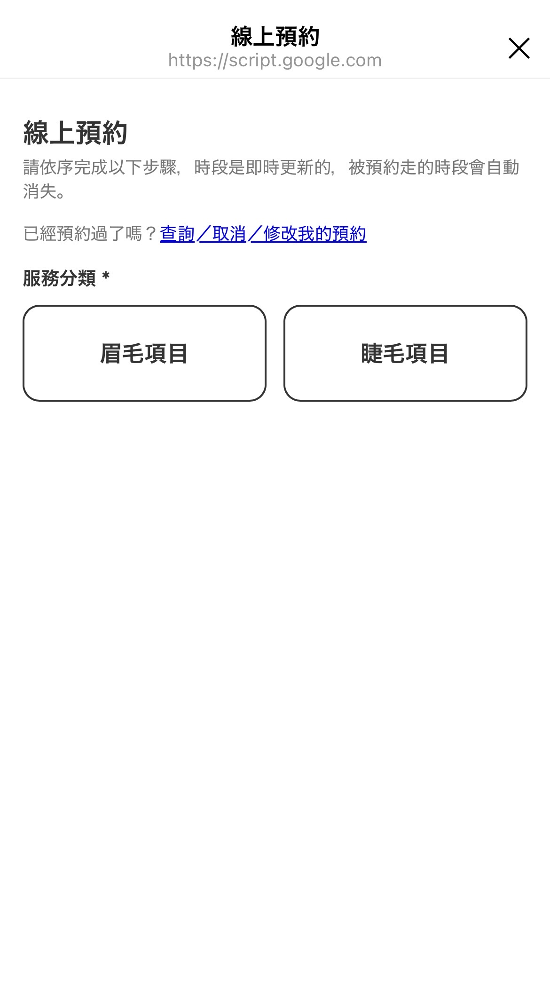</td>
<td>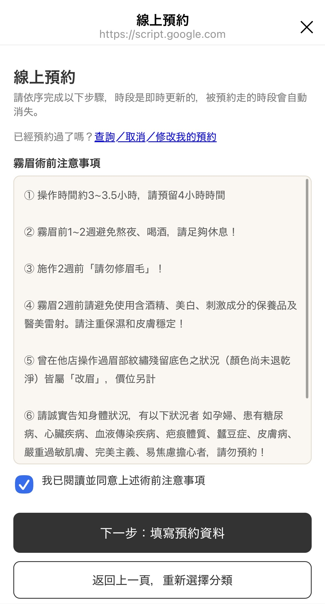</td>
</tr>
<tr>
<th>新客：得知管道</th><th>方案與價格</th><th>舊客：輸入電話自動帶入</th>
</tr>
<tr>
<td>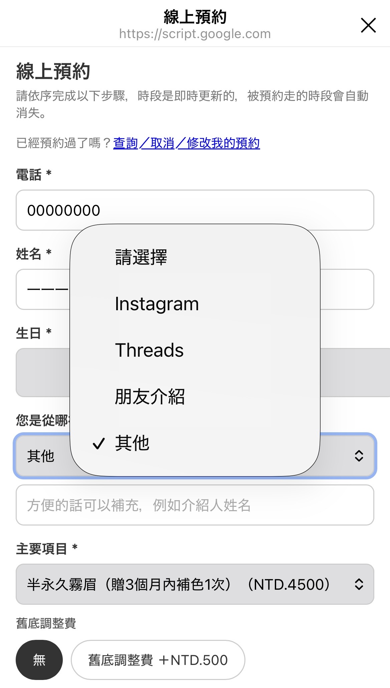</td>
<td>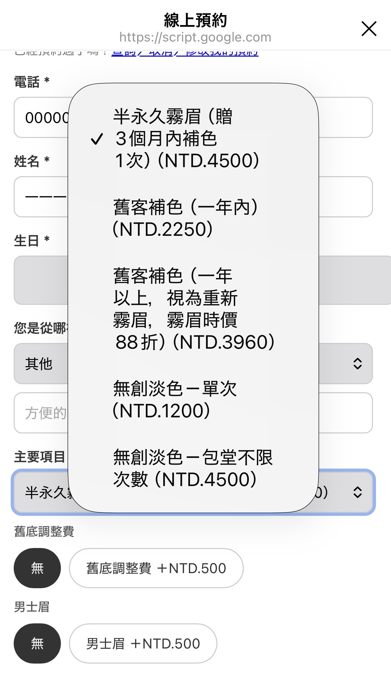</td>
<td>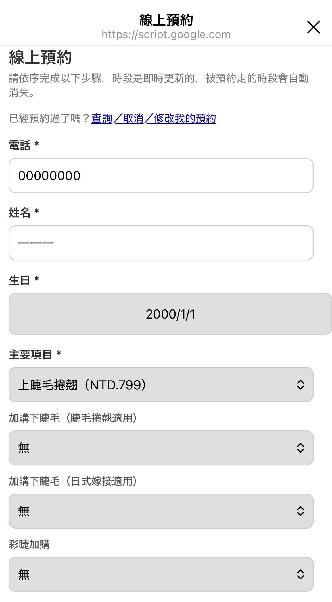</td>
</tr>
<tr>
<th>優惠折抵</th><th>即時空檔月曆</th><th>送出前總表確認</th>
</tr>
<tr>
<td>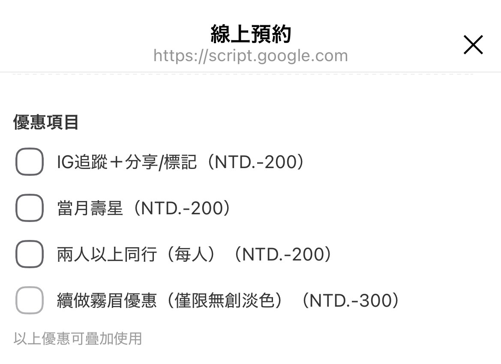</td>
<td></td>
<td></td>
</tr>
</table>

### 2. 預約完成

<table>
<tr><th>新客：顯示訂金資訊</th><th>舊客：顯示來店次數</th></tr>
<tr>
<td>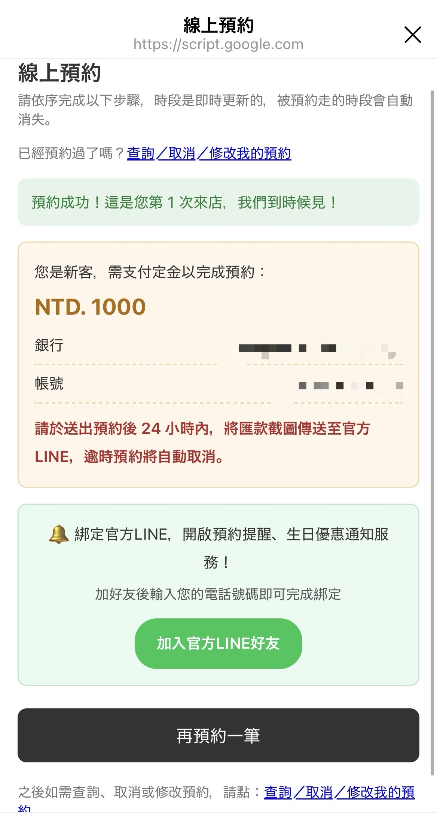</td>
<td>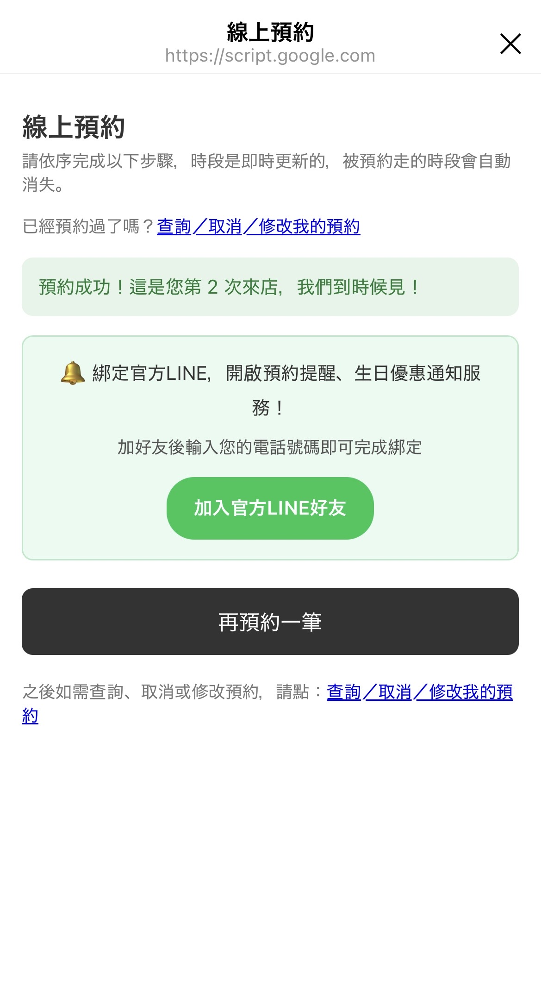</td>
</tr>
</table>

### 3. 查詢／取消／修改預約

<table>
<tr><th>輸入電話查詢</th><th>預約與優惠券一覽</th><th>自助修改時段</th></tr>
<tr>
<td>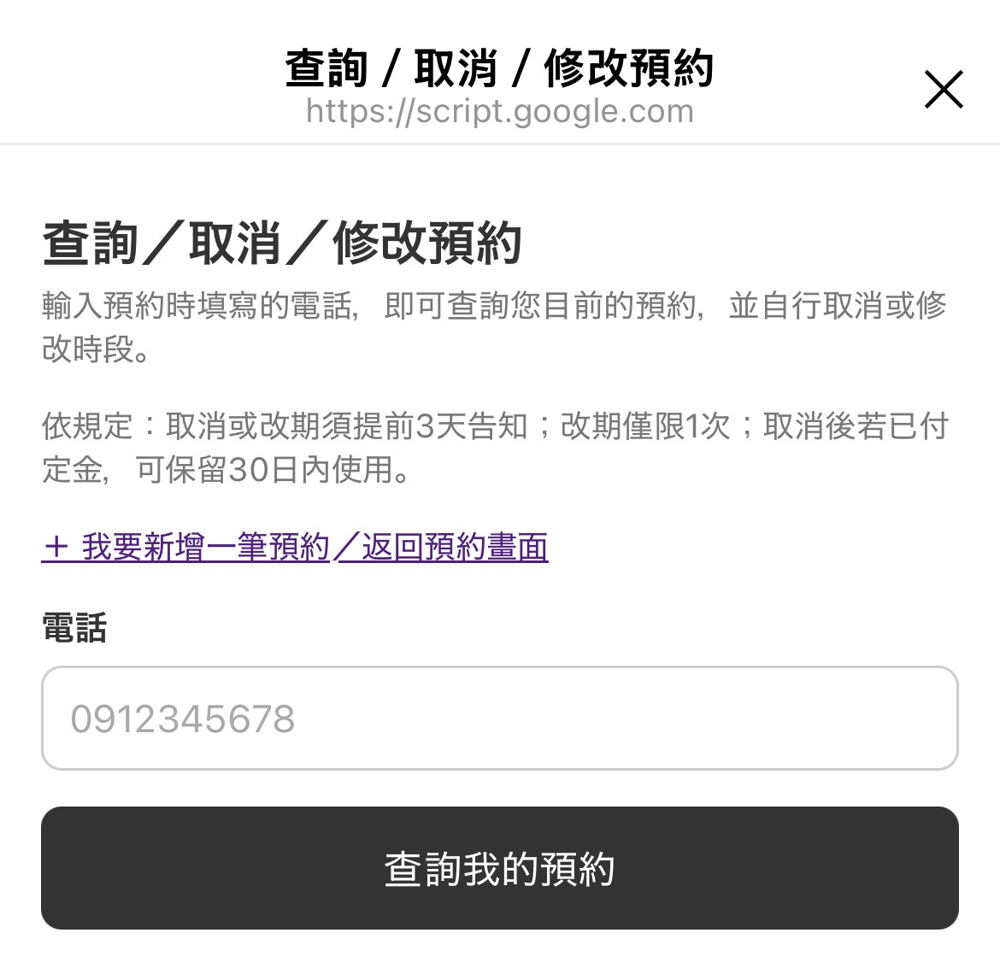</td>
<td>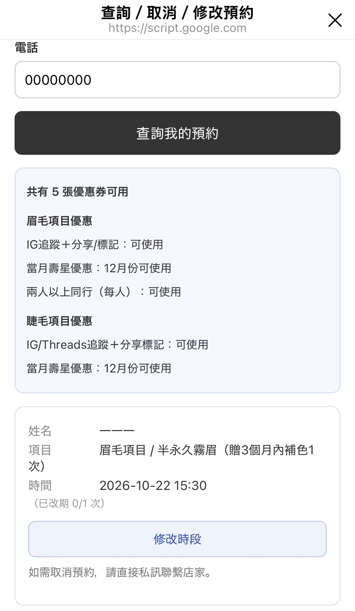</td>
<td>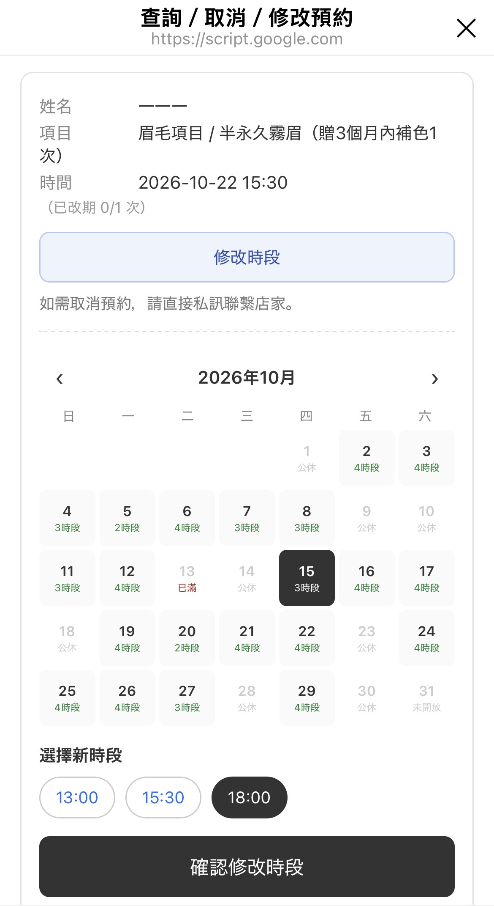</td>
</tr>
</table>

### 4. 店家後台

| Google Calendar | 營業時段設定 |
|---|---|
|  |  |

| 預約紀錄 | 客人資料 |
|---|---|
| 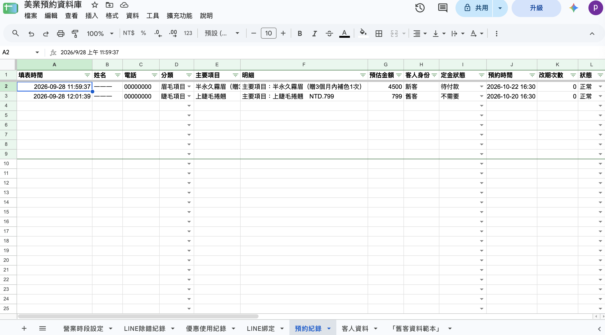 |  |

**Apps Script 專案**

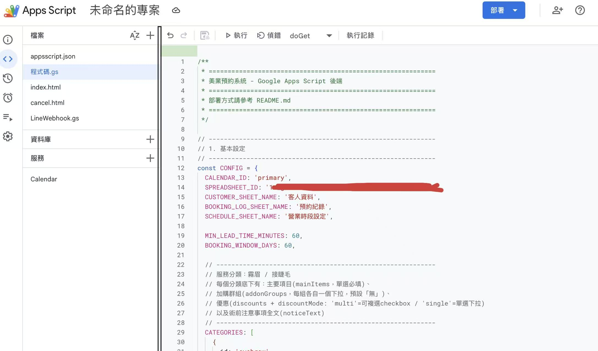

> 截圖中的顧客資料皆為測試資料。

---

## 技術重點

- **防止重複預約（併發控制）**：送出預約時使用 `LockService` 取得鎖，避免兩位客人同時搶同一時段造成 double booking。
- **可預約時段即時計算**：結合「營業時段設定」與 Google Calendar 既有事件，依服務時長判斷每個時段是否衝突，並排除過去時段、明天（不開放線上預約）與預約期限外的日期。
- **試算表 ↔ 日曆雙向同步**：
  - 使用 installable `onEdit` trigger，店家在試算表修改狀態時同步處理
  - 使用 Calendar 進階服務的 `syncToken` 做**增量同步**，店家直接在日曆拖動預約時，只抓取變動過的事件回寫試算表
- **設定驅動（config-driven）的價格邏輯**：項目、加購、優惠集中在 `CONFIG` 物件；支援「依某項目價格打折」的公式價格，以及限定特定項目才能使用的優惠。
- **LINE Webhook 串接**：`doPost` 接收 LINE 事件並分派處理；刻意回傳 `HtmlService` 輸出以避開 Apps Script Web App 的 302 轉址，讓 LINE 的 Webhook 驗證能正確收到 200。
- **單一 Web App 多頁面路由**：`doGet` 依 `?page=` 參數回傳預約頁或查詢頁。

---

## 我的角色與開發方式

這個系統由我**負責需求定義、流程設計、測試與上線**，程式碼則透過與 AI 協作產生與除錯。實際工作包括：

- 從自己工作室的營運痛點出發，拆解出需要自動化的流程與規則（訂金、改期、優惠資格、新舊客判斷等）
- 設計預約流程與畫面順序、試算表資料欄位
- 逐步向 AI 提出需求、閱讀與整合產出的程式碼，並在真實情境中反覆測試與修正問題
- 串接並設定 Google Calendar、Google 試算表、LINE 官方帳號與 Messaging API

這個專案讓我完整走過一次「需求分析 → 系統設計 → 開發 → 測試 → 實際上線使用」的流程，也是我決定轉職系統工程師的起點。

---

## 專案結構

```
beauty-salon-booking-system/
├── README.md
├── images/               # 系統畫面截圖
└── src/
    ├── Code.gs           # 後端主程式：設定、空檔計算、預約寫入、顧客資料、優惠、同步觸發器
    ├── index.html        # 預約頁前端
    ├── cancel.html       # 查詢／取消／修改預約頁
    └── LineWebhook.gs    # LINE Webhook：綁定電話、關鍵字回覆、推播
```

---

## 部署方式

1. 建立一份 Google 試算表，複製網址中的 ID。
2. 在試算表中開啟「擴充功能 → Apps Script」，依 `src/` 建立對應檔案並貼上程式碼。
3. 修改 `Code.gs` 最上方 `CONFIG`：
   - `SPREADSHEET_ID`、`CALENDAR_ID`
   - `BANK_INFO`（匯款資訊）
   - `LINE_CHANNEL_ACCESS_TOKEN`、`LINE_CHANNEL_SECRET`、`LINE_ADD_FRIEND_URL`
   - 服務項目、價格與優惠
4. 在 Apps Script「服務」中啟用 **Google Calendar API**（進階服務，雙向同步使用）。
5. 執行一次 `setupAllSyncTriggers()` 建立觸發器並完成授權。
6. 「部署 → 新增部署作業 → 網頁應用程式」，取得 Web App 網址。
7. 在 LINE Developers 將 Webhook URL 設為該網址，並把預約連結放進官方帳號的圖文選單。

---

## 限制與未來改進

**目前限制**
- 項目、價格與優惠寫在程式設定中，店家無法自行修改，需要由我調整程式碼；較適合項目與價格穩定、月訂單量 100 筆以內的小型工作室。
- Google 試算表作為資料庫，資料量大或多人同時操作時效能有限。

**未來改進方向**
- [ ] 完成「服務反饋」頁面（`feedback.html`）：預約紀錄已預留「反饋表單連結」與「反饋狀態」欄位，每筆預約也會自動產生專屬反饋連結
- [ ] 將服務項目與價格移到試算表中，讓店家不需改程式即可維護
- [ ] 透過時間驅動觸發器，自動推播「來店前三天提醒與工作室地點」及生日優惠提醒（`pushToLine` 已實作）
- [ ] 評估改用關聯式資料庫（如 Cloud SQL / Firebase）以支援更大規模的商家
