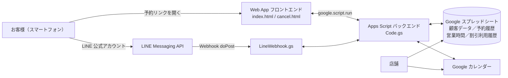

# 美容サロン向け オンライン予約・顧客管理システム
**Beauty Salon Booking System｜Google Apps Script × LINE Messaging API**

[中文](README.md) | 日本語

友人が経営するまつげ・アートメイク（眉）サロンのために、ゼロから開発したオンライン予約システムです。**繰り返し発生する手作業の顧客対応をシステムで置き換えること**を目的としています。お客様は LINE 公式アカウントから予約ページを開き、空き状況の確認、料金の確認、予約の送信、予約内容の照会・日時変更までを自分で行えます。店舗側では Google カレンダーへの自動登録、顧客情報と予約履歴の自動作成が行われます。

> ※ 本システムは台湾のサロン向けに開発したため、画面の表示言語は繁体字中国語です。


---

## 目次
- [解決したい課題](#解決したい課題)
- [システム構成](#システム構成)
- [機能一覧](#機能一覧)
- [画面紹介](#画面紹介)
- [技術的なポイント](#技術的なポイント)
- [担当範囲と開発方法](#担当範囲と開発方法)
- [ディレクトリ構成](#ディレクトリ構成)
- [デプロイ手順](#デプロイ手順)
- [制約と今後の改善](#制約と今後の改善)

---

## 解決したい課題

一人で運営するサロンでは、毎日多くの時間がメッセージのやり取りに費やされていました。これらの作業は反復性が高く、システムで置き換えることができます。

| これまでの手作業 | システム化後 |
|---|---|
| 「いつ空いていますか？」への個別返信 | 予約ページで当月の予約可能日・時間帯をリアルタイム表示 |
| 新規のお客様への前金の案内 | 新規／既存顧客を自動判定し、新規顧客には送信後に前金と振込先を自動表示 |
| 予約をスケジュール帳に手入力 | 予約完了時に Google カレンダーへ自動登録 |
| 氏名・誕生日・電話番号・来店履歴の手作業での整理 | 顧客データと予約履歴を自動作成・更新 |
| 割引の適用条件を手作業で確認 | ルールに基づいて利用可能な割引を判定し、金額を自動計算 |

**技術選定の理由：** Google Apps Script は無料で利用でき、サーバーの構築も不要です。月の予約件数が 100 件以内の小規模サロンであれば機能は十分で、運用コストもほぼかかりません。

---

## システム構成



| コンポーネント | 役割 |
|---|---|
| **Google Apps Script** | バックエンドロジック + Web App のホスティング（サーバーレス） |
| **HTML / CSS / JavaScript** | モバイルファーストの予約画面と「照会／キャンセル／変更」画面 |
| **Google スプレッドシート** | 軽量データベースとして利用：営業時間設定、予約履歴、顧客データ、割引利用履歴、LINE 連携情報 |
| **Google カレンダー** | 店舗側のスケジュール可視化。予約可能枠はカレンダー上の既存予定からリアルタイムに算出 |
| **LINE Messaging API** | 公式アカウントの Webhook：電話番号による連携、予約ページへの導線、予約照会 |

---

## 機能一覧

### お客様側
- **予約前の注意事項への同意**：サロンの規約に同意しないと次へ進めない仕様
- **メニュー選択**：眉・まつげの 2 カテゴリに分かれ、選択後に施術前の注意事項を表示。選び直しも可能
- **新規／既存顧客の自動判定**：
  - 新規顧客は氏名・電話番号・誕生日・来店のきっかけを入力（紹介の場合は紹介者を入力でき、紹介特典の付与に活用）
  - 既存顧客は電話番号を入力するだけで、氏名と誕生日を自動入力
- **空き状況カレンダー**：緑字は予約可、グレーは受付なし、赤字は満席。日付を選ぶと予約可能な時間帯を表示
- **料金の自動計算と割引適用**：すべてのメニュー・追加オプションに料金を表示し、条件を満たす割引を自動適用
- **送信前の確認画面**：内容を確認し、戻って修正可能
- **顧客区分に応じた完了画面**：新規顧客には前金と振込先を、既存顧客には来店回数を表示
- **予約の照会／キャンセル／変更**：電話番号を入力するだけで予約内容と利用可能なクーポンを確認し、自分で日時を変更可能

### 店舗側
- 予約を **Google カレンダー**に自動登録
- **営業時間設定**シートで予約受付枠を管理
- **予約履歴**シート：新規／既存、日時変更の有無、施術内容、前金の状況など
- **顧客データ**シート：氏名、誕生日、電話番号、初回来店日、来店回数、直近の施術、クーポンの状況
- スプレッドシートやカレンダーでの手動変更をシステムへ**双方向同期**

### LINE 公式アカウント
- トーク画面で電話番号を送信すると **LINE アカウントと予約データを連携**。LINE ユーザーと予約者が同一人物であることを店舗側で確認可能
- キーワード自動応答：予約ページへの案内、予約照会、空き状況の問い合わせ

---

## 画面紹介

### 1. 予約の流れ（お客様側）

<table>
<tr>
<th>予約前の注意事項</th><th>カテゴリ選択</th><th>施術前の注意事項</th>
</tr>
<tr>
<td></td>
<td></td>
<td></td>
</tr>
<tr>
<th>新規：来店のきっかけ</th><th>メニューと料金</th><th>既存：電話番号で自動入力</th>
</tr>
<tr>
<td></td>
<td></td>
<td></td>
</tr>
<tr>
<th>割引の適用</th><th>空き状況カレンダー</th><th>送信前の確認画面</th>
</tr>
<tr>
<td></td>
<td></td>
<td></td>
</tr>
</table>

### 2. 予約完了

<table>
<tr><th>新規：前金のご案内</th><th>既存：来店回数の表示</th></tr>
<tr>
<td></td>
<td></td>
</tr>
</table>

### 3. 予約の照会／キャンセル／変更

<table>
<tr><th>電話番号で照会</th><th>予約とクーポンの一覧</th><th>日時の変更</th></tr>
<tr>
<td></td>
<td></td>
<td></td>
</tr>
</table>

### 4. 店舗側の管理画面

| Google カレンダー | 営業時間設定 |
|---|---|
|  |  |

| 予約履歴 | 顧客データ |
|---|---|
|  |  |

**Apps Script プロジェクト**


> スクリーンショット内の顧客データはすべてテスト用のものです。

---

## 技術的なポイント

- **二重予約の防止（排他制御）**：予約送信時に `LockService` でロックを取得し、複数のお客様が同じ時間帯を同時に予約することによる二重予約を防止。
- **予約可能枠のリアルタイム算出**：「営業時間設定」と Google カレンダーの既存予定を組み合わせ、施術時間をもとに各時間帯の重複を判定。過去の時間帯、翌日（オンライン予約不可）、予約受付期間外の日付は除外。
- **スプレッドシート ↔ カレンダーの双方向同期**：
  - インストール型の `onEdit` トリガーにより、店舗がスプレッドシート上でステータスを変更した際に同期処理を実行
  - Calendar 拡張サービスの `syncToken` を用いた**差分同期**により、店舗がカレンダー上で予約を移動した際、変更のあった予定のみを取得してスプレッドシートに反映
- **設定駆動（config-driven）の料金ロジック**：メニュー・追加オプション・割引を `CONFIG` オブジェクトに集約。「特定メニューの料金に対する割引」といった計算式ベースの料金や、特定メニュー限定の割引にも対応。
- **LINE Webhook 連携**：`doPost` で LINE のイベントを受け取り処理を振り分け。Apps Script Web App の 302 リダイレクトを回避するため、あえて `HtmlService` で応答を返し、LINE の Webhook 検証で正しく 200 を受け取れるように対応。
- **単一 Web App での複数ページのルーティング**：`doGet` で `?page=` パラメータに応じて予約ページまたは照会ページを返却。

---

## 担当範囲と開発方法

本システムでは、私が**要件定義、業務フロー設計、テスト、本番運用までを担当**し、プログラムは AI との協働によって生成・デバッグを行いました。具体的な作業は以下のとおりです。

- 友人のサロンの業務課題をもとに、自動化すべき業務フローとルール（前金、日時変更、割引の適用条件、新規／既存顧客の判定など）を整理
- 予約フローと画面遷移、スプレッドシートのデータ項目を設計
- AI に段階的に要件を伝え、生成されたコードを読んで統合し、実際の利用場面で繰り返しテストと修正を実施
- Google カレンダー、Google スプレッドシート、LINE 公式アカウントと Messaging API の連携・設定

このプロジェクトを通じて「要件分析 → システム設計 → 開発 → テスト → 本番運用」という一連の流れを経験しました。これが、システムエンジニアへの転職を決意するきっかけとなりました。

---

## ディレクトリ構成

```
beauty-salon-booking-system/
├── README.md             # 中国語版
├── README.ja.md          # 日本語版
├── images/               # 画面のスクリーンショット
└── src/
    ├── Code.gs           # バックエンド本体：設定、空き枠計算、予約登録、顧客データ、割引、同期トリガー
    ├── index.html        # 予約ページ
    ├── cancel.html       # 予約の照会／キャンセル／変更ページ
    └── LineWebhook.gs    # LINE Webhook：電話番号連携、キーワード応答、プッシュ通知
```

---

## デプロイ手順

1. Google スプレッドシートを作成し、URL に含まれる ID をコピーする。
2. スプレッドシートの「拡張機能 → Apps Script」を開き、`src/` と同じ構成でファイルを作成してコードを貼り付ける。
3. `Code.gs` 冒頭の `CONFIG` を編集する：
   - `SPREADSHEET_ID`、`CALENDAR_ID`
   - `BANK_INFO`（振込先情報）
   - `LINE_CHANNEL_ACCESS_TOKEN`、`LINE_CHANNEL_SECRET`、`LINE_ADD_FRIEND_URL`
   - メニュー、料金、割引
4. Apps Script の「サービス」で **Google Calendar API**（拡張サービス、双方向同期に使用）を有効にする。
5. `setupAllSyncTriggers()` を一度実行してトリガーを作成し、権限を承認する。
6. 「デプロイ → 新しいデプロイ → ウェブアプリ」から Web App の URL を取得する。
7. LINE Developers で Webhook URL にその URL を設定し、予約リンクを公式アカウントのリッチメニューに配置する。

---

## 制約と今後の改善

**現在の制約**
- メニュー・料金・割引はプログラムの設定に記述しているため、店舗側で変更できず、私がコードを修正する必要があります。メニューと料金が安定しており、月の予約件数が 100 件以内の小規模サロンに適しています。
- Google スプレッドシートをデータベースとして使用しているため、データ量が多い場合や複数人が同時に操作する場合には性能面の限界があります。

**今後の改善予定**
- [ ] 「施術後アンケート」ページ（`feedback.html`）の実装：予約履歴には「アンケートリンク」「回答状況」の項目を用意済みで、予約ごとに専用のアンケートリンクも自動生成済み
- [ ] メニューと料金をスプレッドシートで管理し、店舗側でプログラムを修正せずに更新できるようにする
- [ ] 時間主導型トリガーを用いて、「来店 3 日前のリマインドとサロンの所在地」や誕生日特典のお知らせを自動送信（`pushToLine` は実装済み）
- [ ] より大規模な店舗に対応するため、本格的なデータベース（リレーショナル DB の Cloud SQL、または NoSQL の Firestore など）への移行を検討| **Google Apps Script** | 後端邏輯 + Web App 託管（Serverless） |
| **HTML / CSS / JavaScript** | 手機優先的預約前端與「查詢／取消／修改」頁面 |
| **Google 試算表** | 當作輕量資料庫：營業時段設定、預約紀錄、顧客資料、優惠使用紀錄、LINE 綁定 |
| **Google Calendar** | 店家可視化排程；可預約時段依日曆既有事件即時計算 |
| **LINE Messaging API** | 官方帳號 Webhook：電話綁定、快速預約入口、查詢預約 |

---

## 功能總覽

### 客人端
- **預約須知確認**：需勾選同意工作室規範才能進入下一步
- **項目選擇**：分為眉毛／睫毛兩大類，選擇後顯示對應的術前注意事項，可返回重選
- **新舊客自動識別**：
  - 新客填寫姓名、電話、生日與得知管道（朋友介紹可填寫介紹人，方便店家發放推薦優惠）
  - 舊客只需輸入電話，系統自動帶入姓名與生日
- **即時空檔月曆**：綠字可預約、灰底不開放、紅字已額滿，點選日期顯示可選時段
- **金額試算與優惠折抵**：所有方案、加購項目皆顯示價格，符合資格的優惠自動折抵
- **送出前總表確認**：可返回修改
- **預約結果依客群區分**：新客顯示訂金與匯款資訊；舊客顯示第幾次來店
- **查詢／取消／修改預約**：輸入電話即可查看預約與可用優惠券，並自助改期

### 店家端
- 預約自動寫入 **Google Calendar**
- **營業時段設定**表控制系統可預約時段
- **預約紀錄**表：新舊客、是否改期、服務項目、訂金狀態等
- **客人資料**表：姓名、生日、電話、首次來店、到店次數、最近服務、優惠券狀態
- 在試算表或日曆上手動調整，會**雙向同步**回系統

### LINE 官方帳號
- 客人在對話框輸入電話即可**綁定 LINE 帳號與預約資料**，讓店家確認 LINE 用戶與填表者為同一人
- 關鍵字快速回覆：預約入口、查詢預約、詢問時段

---

## 畫面展示

### 1. 預約流程（客人端）

<table>
<tr>
<th>預約須知</th><th>選擇項目分類</th><th>術前注意事項</th>
</tr>
<tr>
<td></td>
<td></td>
<td></td>
</tr>
<tr>
<th>新客：得知管道</th><th>方案與價格</th><th>舊客：輸入電話自動帶入</th>
</tr>
<tr>
<td></td>
<td></td>
<td></td>
</tr>
<tr>
<th>優惠折抵</th><th>即時空檔月曆</th><th>送出前總表確認</th>
</tr>
<tr>
<td></td>
<td></td>
<td></td>
</tr>
</table>

### 2. 預約完成

<table>
<tr><th>新客：顯示訂金資訊</th><th>舊客：顯示來店次數</th></tr>
<tr>
<td></td>
<td></td>
</tr>
</table>

### 3. 查詢／取消／修改預約

<table>
<tr><th>輸入電話查詢</th><th>預約與優惠券一覽</th><th>自助修改時段</th></tr>
<tr>
<td></td>
<td></td>
<td></td>
</tr>
</table>

### 4. 店家後台

| Google Calendar | 營業時段設定 |
|---|---|
|  |  |

| 預約紀錄 | 客人資料 |
|---|---|
|  |  |

**Apps Script 專案**


> 截圖中的顧客資料皆為測試資料。

---

## 技術重點

- **防止重複預約（併發控制）**：送出預約時使用 `LockService` 取得鎖，避免兩位客人同時搶同一時段造成 double booking。
- **可預約時段即時計算**：結合「營業時段設定」與 Google Calendar 既有事件，依服務時長判斷每個時段是否衝突，並排除過去時段、明天（不開放線上預約）與預約期限外的日期。
- **試算表 ↔ 日曆雙向同步**：
  - 使用 installable `onEdit` trigger，店家在試算表修改狀態時同步處理
  - 使用 Calendar 進階服務的 `syncToken` 做**增量同步**，店家直接在日曆拖動預約時，只抓取變動過的事件回寫試算表
- **設定驅動（config-driven）的價格邏輯**：項目、加購、優惠集中在 `CONFIG` 物件；支援「依某項目價格打折」的公式價格，以及限定特定項目才能使用的優惠。
- **LINE Webhook 串接**：`doPost` 接收 LINE 事件並分派處理；刻意回傳 `HtmlService` 輸出以避開 Apps Script Web App 的 302 轉址，讓 LINE 的 Webhook 驗證能正確收到 200。
- **單一 Web App 多頁面路由**：`doGet` 依 `?page=` 參數回傳預約頁或查詢頁。

---

## 我的角色與開發方式

這個系統由我**負責需求定義、流程設計、測試與上線**，程式碼則透過與 AI 協作產生與除錯。實際工作包括：

- 從自己工作室的營運痛點出發，拆解出需要自動化的流程與規則（訂金、改期、優惠資格、新舊客判斷等）
- 設計預約流程與畫面順序、試算表資料欄位
- 逐步向 AI 提出需求、閱讀與整合產出的程式碼，並在真實情境中反覆測試與修正問題
- 串接並設定 Google Calendar、Google 試算表、LINE 官方帳號與 Messaging API

這個專案讓我完整走過一次「需求分析 → 系統設計 → 開發 → 測試 → 實際上線使用」的流程，也是我決定轉職系統工程師的起點。

---

## 專案結構

```
beauty-salon-booking-system/
├── README.md
├── images/               # 系統畫面截圖
└── src/
    ├── Code.gs           # 後端主程式：設定、空檔計算、預約寫入、顧客資料、優惠、同步觸發器
    ├── index.html        # 預約頁前端
    ├── cancel.html       # 查詢／取消／修改預約頁
    └── LineWebhook.gs    # LINE Webhook：綁定電話、關鍵字回覆、推播
```

---

## 部署方式

1. 建立一份 Google 試算表，複製網址中的 ID。
2. 在試算表中開啟「擴充功能 → Apps Script」，依 `src/` 建立對應檔案並貼上程式碼。
3. 修改 `Code.gs` 最上方 `CONFIG`：
   - `SPREADSHEET_ID`、`CALENDAR_ID`
   - `BANK_INFO`（匯款資訊）
   - `LINE_CHANNEL_ACCESS_TOKEN`、`LINE_CHANNEL_SECRET`、`LINE_ADD_FRIEND_URL`
   - 服務項目、價格與優惠
4. 在 Apps Script「服務」中啟用 **Google Calendar API**（進階服務，雙向同步使用）。
5. 執行一次 `setupAllSyncTriggers()` 建立觸發器並完成授權。
6. 「部署 → 新增部署作業 → 網頁應用程式」，取得 Web App 網址。
7. 在 LINE Developers 將 Webhook URL 設為該網址，並把預約連結放進官方帳號的圖文選單。

---

## 限制與未來改進

**目前限制**
- 項目、價格與優惠寫在程式設定中，店家無法自行修改，需要由我調整程式碼；較適合項目與價格穩定、月訂單量 100 筆以內的小型工作室。
- Google 試算表作為資料庫，資料量大或多人同時操作時效能有限。

**未來改進方向**
- [ ] 完成「服務反饋」頁面（`feedback.html`）：預約紀錄已預留「反饋表單連結」與「反饋狀態」欄位，每筆預約也會自動產生專屬反饋連結
- [ ] 將服務項目與價格移到試算表中，讓店家不需改程式即可維護
- [ ] 透過時間驅動觸發器，自動推播「來店前三天提醒與工作室地點」及生日優惠提醒（`pushToLine` 已實作）
- [ ] 評估改用關聯式資料庫（如 Cloud SQL / Firebase）以支援更大規模的商家
