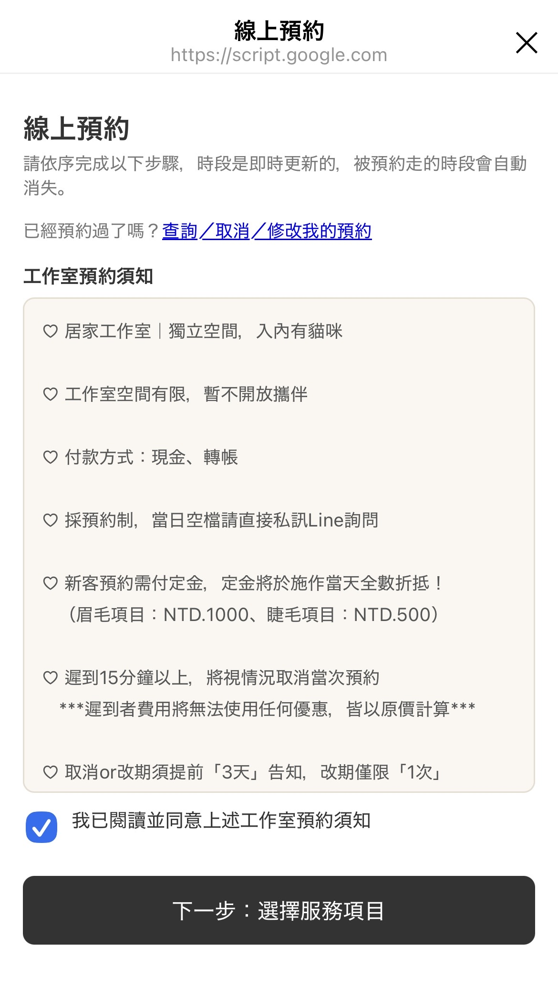
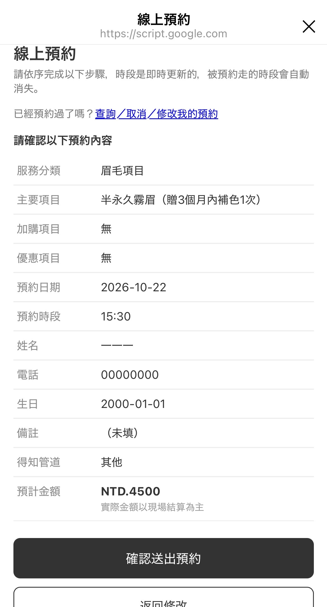
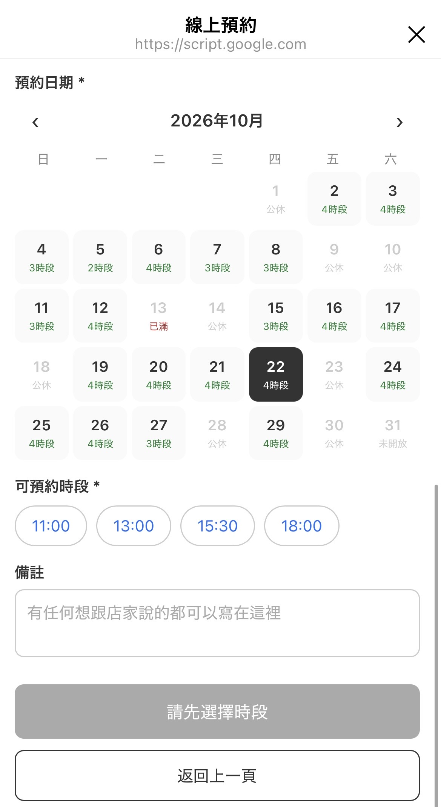
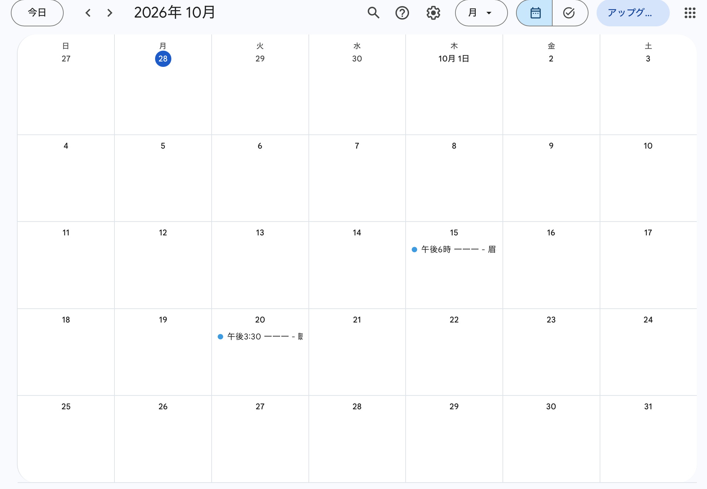
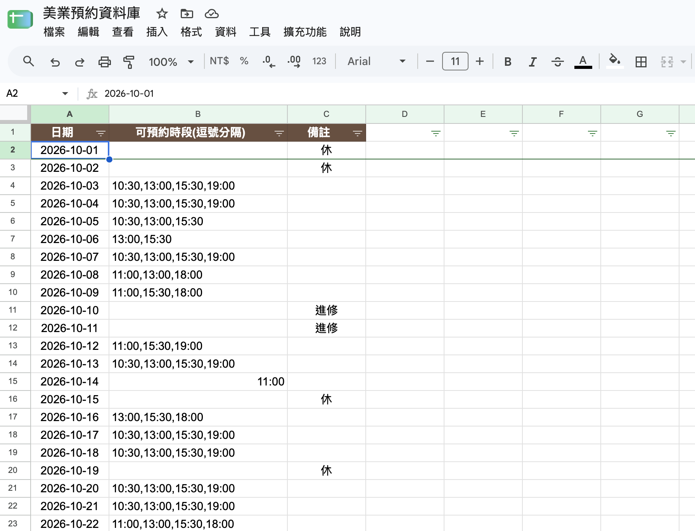
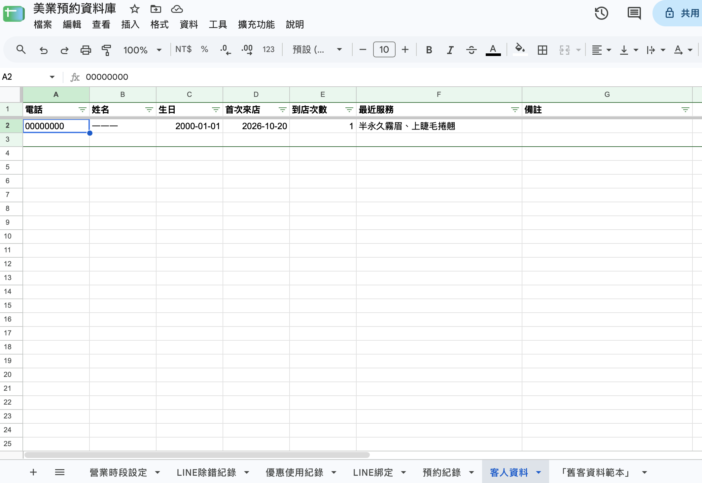

# 輕量化美業線上預約與客戶管理系統 (Beauty Salon Booking System)

一個基於 **Google Apps Script (GAS)** 與 **LINE Messaging API** 開發的端到端（End-to-End）自動化預約與 CRM 系統。專為小型美業工作室設計，旨在以低成本的 IT 自動化取代人工客服，提升顧客預約體驗並降低營運溝通成本。

---

### 💡 專案背景與解決痛點

傳統小型工作室常面臨以下營運痛點：
1. **人工溝通成本高：** 需要手動來回確認可預約時段、提醒付訂金、整理顧客資料與時間。
2. **資訊分散且易出錯：** 手動登錄日曆易導致重複預約（Double Booking），且舊客紀錄難以追蹤。

**解決方案：**
打造全自動化線上預約流程，從顧客查詢空檔、線上試算金額、提交預約、自動同步 Google 日曆，到綁定 LINE 官方帳號自動發送提醒，實現完全無縫的自動化流程。

---

### 🏗️ 系統架構與技術選型 (System Architecture & Tech Stack)

#### **技術選型 Reasons for Tech Stack**
* **Google Apps Script (GAS)：** 作為輕量化後端與 Web App 託管平台，零伺服器維護成本（Serverless）、完全免費，適合月訂單量 < 100 筆的微型商家。
* **Google Sheets：** 作為雲端資料庫（RDB 替代方案），儲存營業時段、預約紀錄、顧客 CRM 資料及優惠券紀錄。
* **Google Calendar API：** 可視化行事曆排程，自動建立預約日程並即時防護時段衝突。
* **LINE Messaging API (Webhook)：** 串聯官方帳號，進行顧客身份綁定、發送行前提醒與優惠通知。

---

### ✨ 核心功能說明 (Key Features)

#### 1. 顧客端 (Client-side Web App)
* **動態即時空檔查詢：** 系統實時比對商家日曆與營業時段，僅顯示可預約時間段（紅字已滿、灰底不開放、綠字可選）。
* **自動識別新舊客：** 輸入電話號碼即可自動帶入舊客資料；新客自動導引付訂金流程。
* **試算與優惠折抵：** 包含類別選擇（眉毛/睫毛）、術前注意事項同意、優惠券可疊加折抵，自動試算預約總金額。
* **訂單查詢與自助改期：** 顧客可隨時透過電話號碼查詢訂單、檢視可用優惠券，並在符合規範條件下自助修改時段。

#### 2. 商家端 (Admin & Automated Management)
* **自動排程同步：** 預約成功後自動寫入 Google Calendar，避免重複預約。
* **自動化 CRM 客戶管理：** Google Sheet 自動歸檔顧客基本資料、到店次數、歷史消費紀錄與優惠券發放狀態。
* **動態排班控制：** 商家可直接在 Sheet 的「營業時段設定」分頁彈性修改每日開放時段與公休時間。

---

### 📸 系統畫面展示 (Screenshots & Flow)

#### 1. 預約與試算流程
| 預約須知與項目選擇 | 舊客帶入與金額試算 | 即時可預約時段月曆 |
| :---: | :---: | :---: |
|  |  |  |

#### 2. 預約完成與 LINE 綁定
* **新客預約：** 顯示匯款訂金資訊與 24 小時內完成提醒。
* **舊客預約：** 顯示來店次數與 LINE 官方帳號綁定引導。

#### 3. 後台管理 (Google Sheet & Calendar)
| Google Calendar 自動同步 | 營業時段與排班控制 | CRM 顧客歷史紀錄 |
| :---: | :---: | :---: |
|  |  |  |

---

### ⚙️ 專案程式碼結構 (Code Structure)

```text
├── Code.gs             # 後端主邏輯 (處理 API 請求、資料讀寫、日曆同步)
├── index.html          # 前端主要預約介面 (包含動態表單與試算邏輯)
├── cancel.html         # 前端查詢與修改預約介面
└── LineWebhook.gs      # LINE Messaging API Webhook 接收與訊息推播
